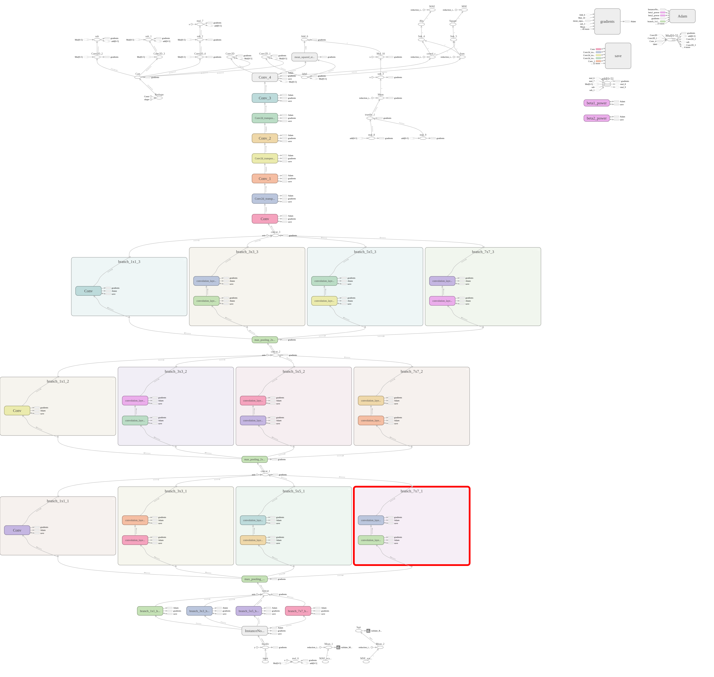

# SANET_IMPLEMENTATION
## implemented by Yezhen Wang through tensorflow
### PROLOGUE
Plainspoken, the current above implementation can't reach the results gotten by the author.And on the ShanghaiTech_B dataset, my SANet model only get 21.838 in MAE and 39.387 in MSE which far less than the 8.4 in MAE and 13.6 in MSE which mentioned in the papers. Besides, I and my colleague both found a phenomena that once the network was added the instance normalization layer after each convolutional layer, then the model would output an uniform predicting density map readily.Thus, we both decided cut all the In layer dawn.  
### PREDICTION ON SHANGHAITECH_B DATASET
just put some good samples here 

### GRAPH_STRUCTURE
the graph was obtained by using Tensorboard.So there are lots of tiny tensorflow op which you may not want to see.
  we can juse ignore those inessential ops and focus on the main backbone of the network.

### MAE AND RMSE TENDENCY CHART
The tendency chart of the validate set's MAE and MSE on the training model along with the changes of the time and training step
  Get by using Tensorboard
#### MAE tendency along with the training time

#### MAE tendency along with tht step

#### RMSE tendency along with the training time

#### RMSE tendency along with the step
